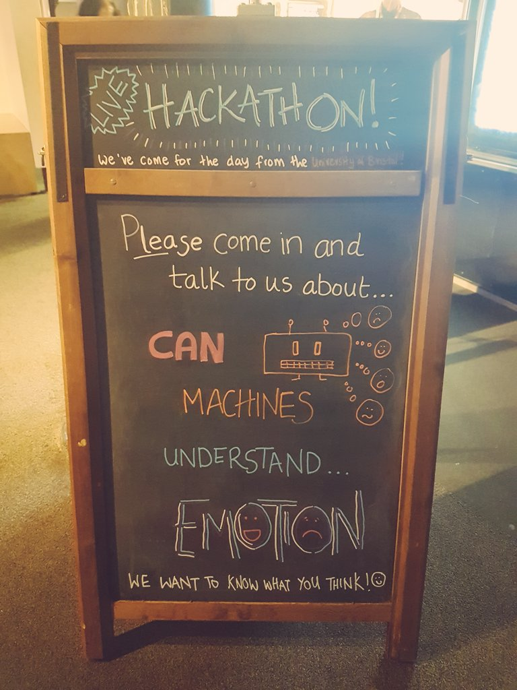

This project is the result of our lab group winning a competition hosted by Bristol's local science museum, [We the Curious](). You can read more about [our entry to the competition here](https://jeangoldinginstitute.blogs.bristol.ac.uk/2019/07/23/can-machines-understand-emotion-curiosity-challenge-winners-announced/). We proposed our own 'curiosity toolkit' that explores how machines learn from data, and machines can learn about emotions from data. What are machines good at, what are they bad at? How might it be useful, or bad, for machines to understand how we feel?

Our 'curiosity toolkit' has so far involved several lab hackathons, one of which was based at We The Curious so that members of the public could come in and talk to us about what we were doing! 

The toolkit was going to be launched in May 2020 but unfortunately COVID-19 got in the way. We hope that we will be able to share it when We The Curious opens back up, along with the opening of their new Open City Lab. 